

  
  

  
  ### CinemaApp: приложение для кинотеатра (админ + клиент) C#
  
  CinemaApp - это приложение для управления кинотеатрами, сеансами, залами, и для ведения отчетности, разработанное с использованием языка программирования C#. Реализована авторизация для администратора. Приложение также предназначено клиентов: просмотр фильмов в прокате, рейтинг фильма, поиск фильмов (+ расширенный поиск), бронирование и печать билета.
  
  

#### Ключевые особенности:

1. **База данных MS SQL Server:** Приложение использует SQL Server для хранения медицинских данных, обеспечивая их надежность и производительность.

2. **ADO.NET:** Для взаимодействия с базой данных использовалась библиотека ADO.NET, обеспечивающий интуитивно понятное взаимодействие с БД.

3. **Аутентификация и авторизация:** Для обеспечения безопасности данных реализованы механизмы аутентификации и авторизации пользователей.

4. **Адаптивный дизайн:** Применяются методы адаптивной верстки, Dock Fill, Anchor, TableLayoutView, FlowLayoutPanel.

5. **Оптимизация производительности:** Применяются методы оптимизации базы данных и запросов для обеспечения быстрого доступа к информации.

#### Цель:

Цель CinemaApp - реализовать приложения просмотра фильмов в прокате, бронирования билетов, и печати чека; и администрирование кинотеатров, сеансов, залов, ведение отчетности.

#### План разработки:

План разработки включает в себя доработку пользовательского интерфейса, улучшение функциональности, реализацию адаптивности и оптимизацию производительности.

#### Скриншоты:
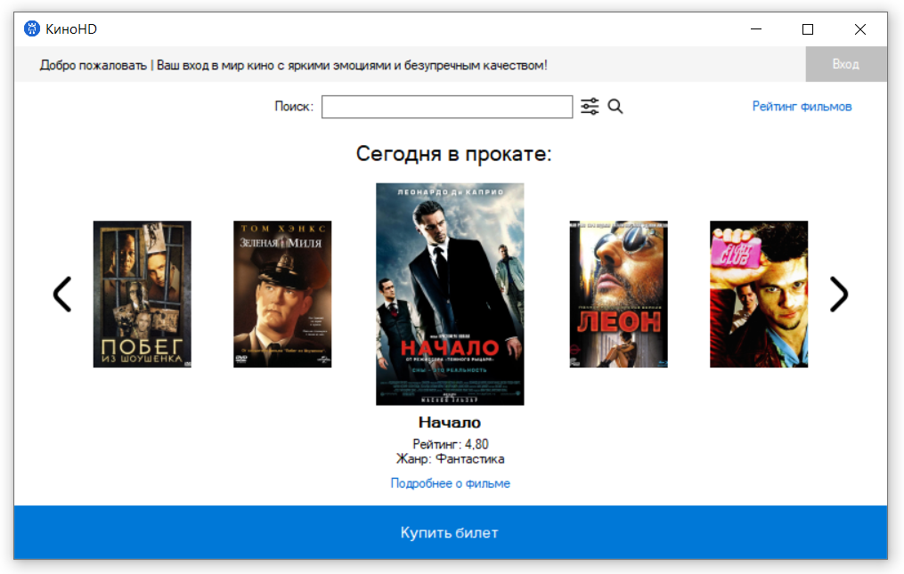
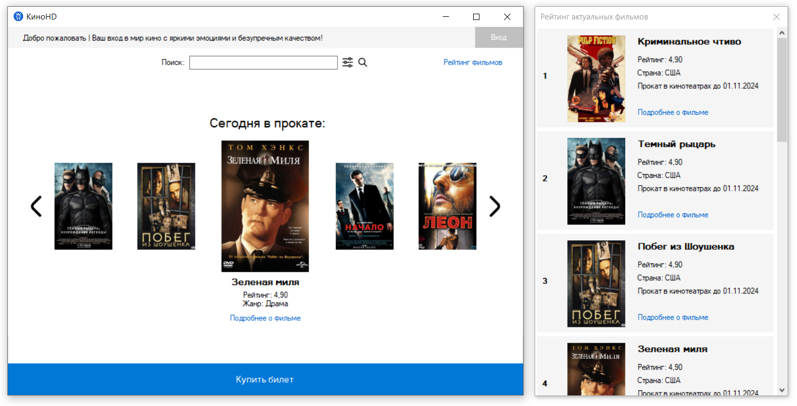
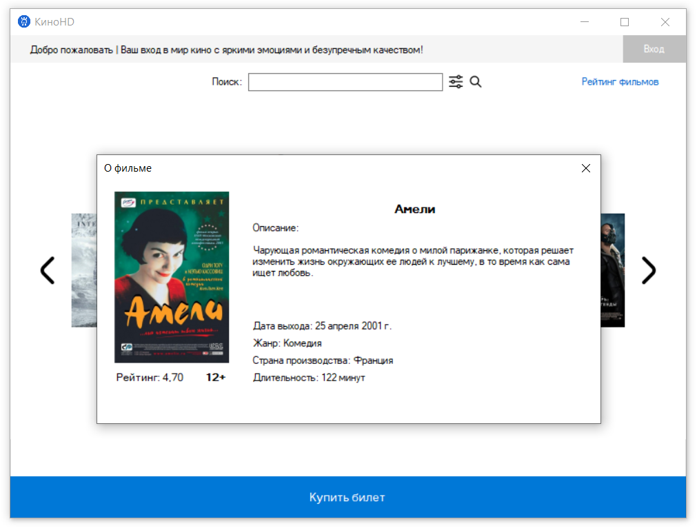
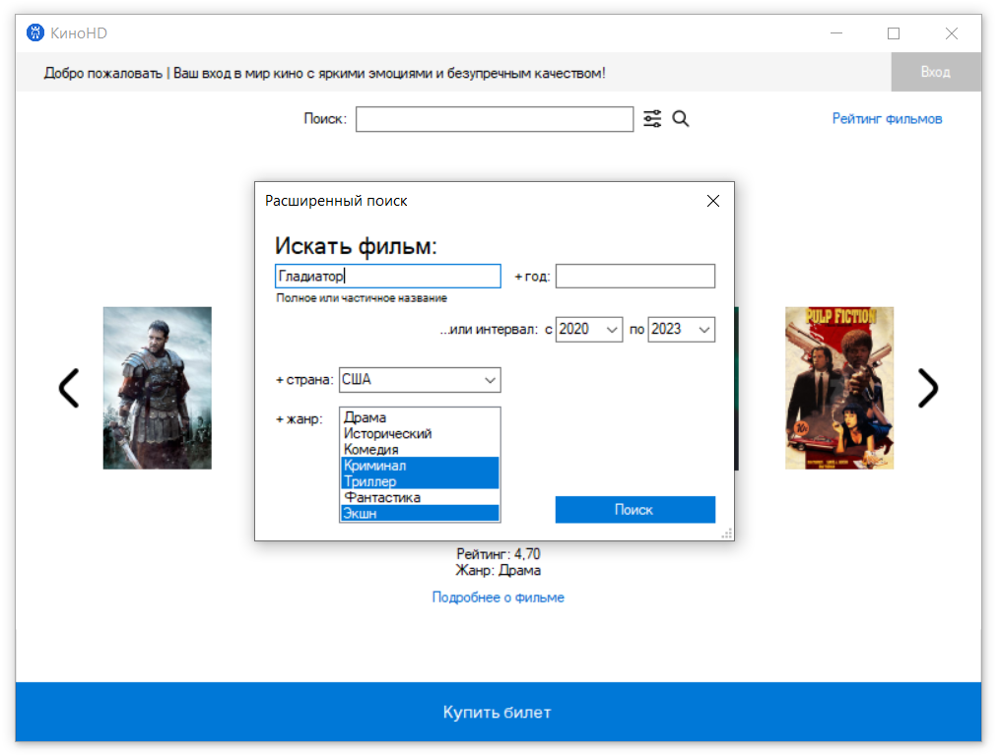
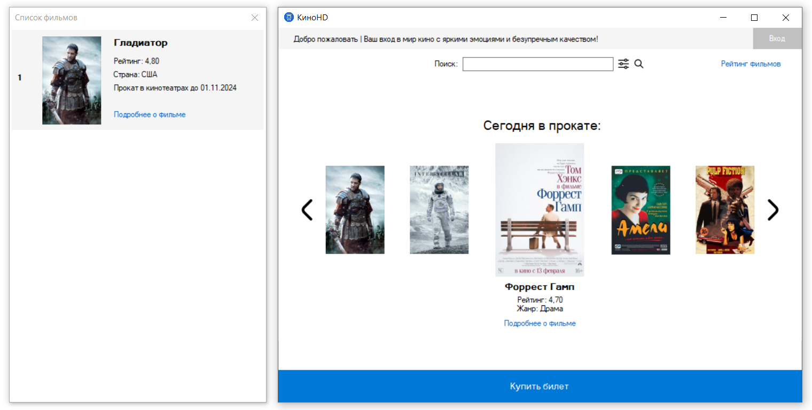
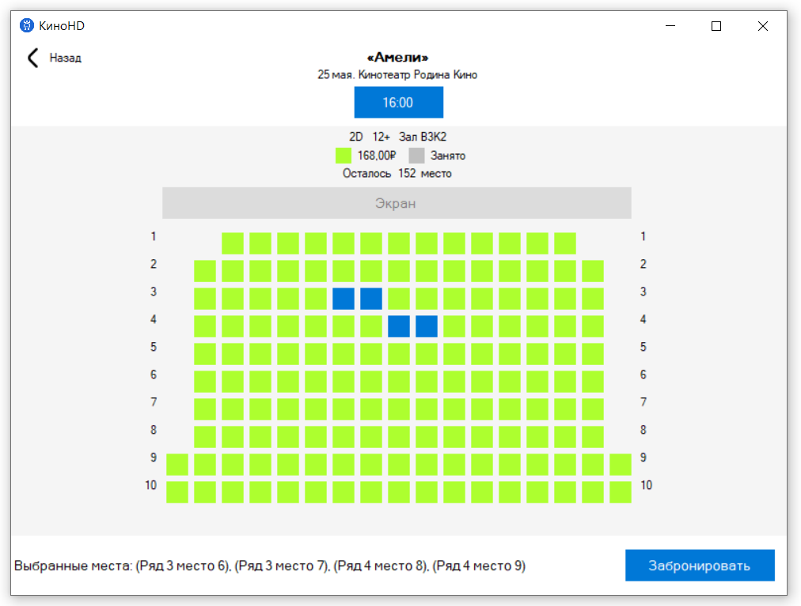
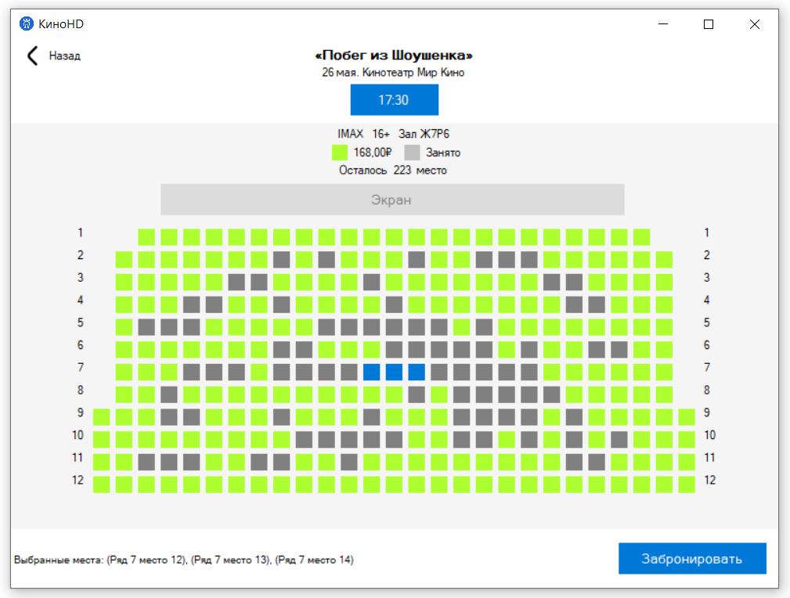
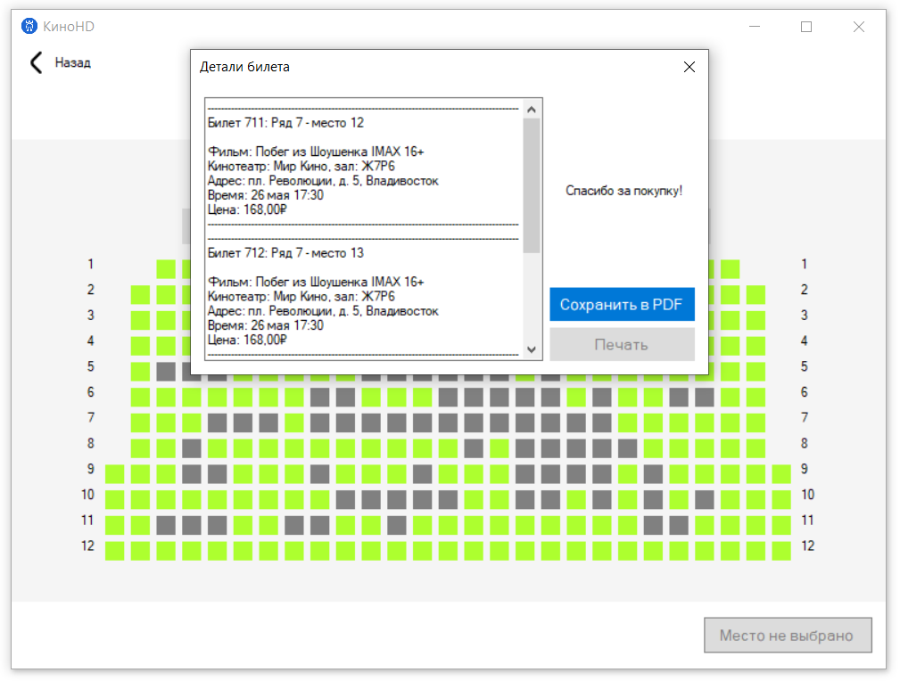
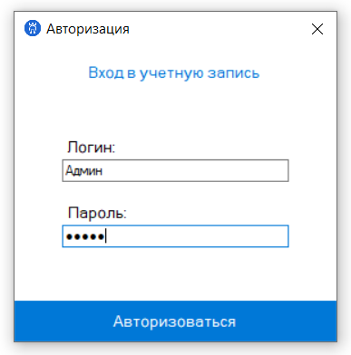
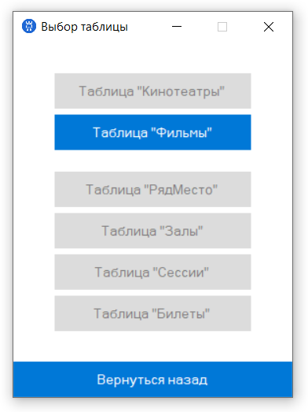
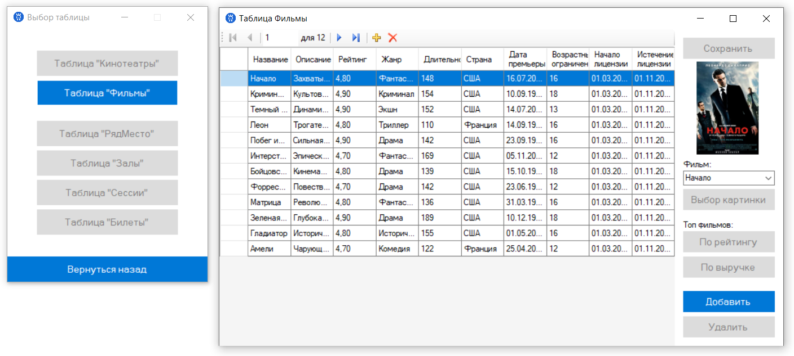
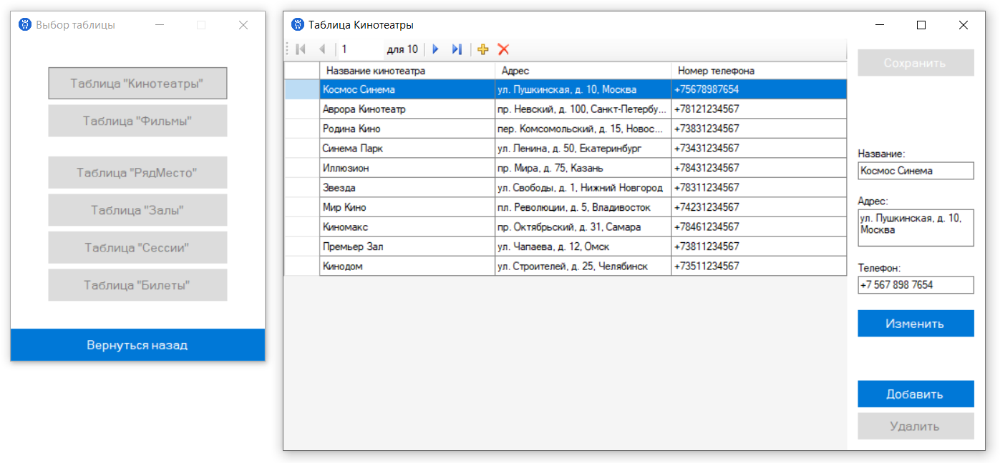
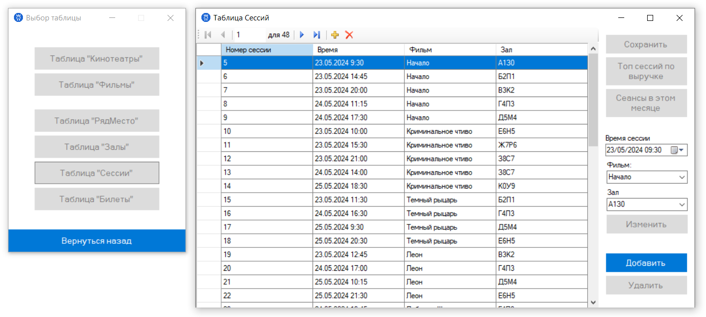
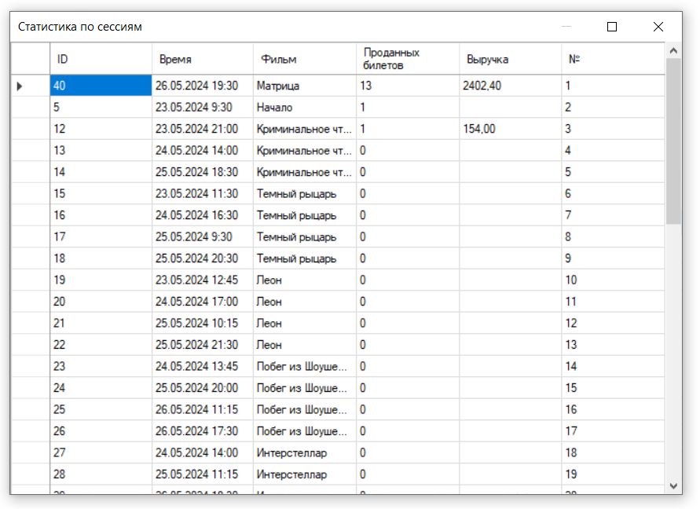

#### Связь со мной:
[Вконтакте](https://vk.com/true_lnz/)
[Телеграм](https://t.me/lansonz/)
